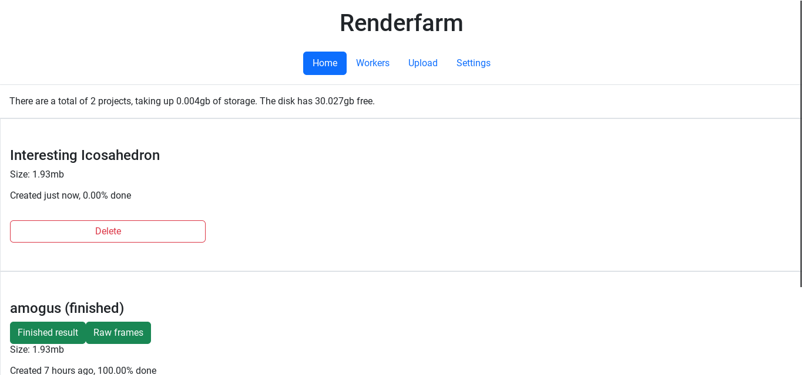

# Renderfarm

    

 

Complete blender renderfarm. School project.

Web interface | Simple usage | Contained workers
--- | --- | ---
 |  | 

For installation and other questions [read the docs](./doc/README.md)

Full software solution for distributing renders between a cluster-like set of computers. A master server computer with a web dashboard accepts people uploading blender projects, and distributes tasks between workers.

## Features
- Web dashboard for complete management of network
- Easily upload blender project via web interface
- Simple contained system for the worker, can easily be turned on/off
- Designed to be left unattended
- Theoretically works on any device running linux that meets blenders' minimum requirements

## Intended Usage
This project was started to find a use for a collection of old Mini PCs and a network switch, whilst also solving a real problem.

## Docs & Contact
[Documentation](./doc/README.md)

For troubleshooting and issues, open a [GitHub issue](https://github.com/Arkanic/renderfarm/issues/new)