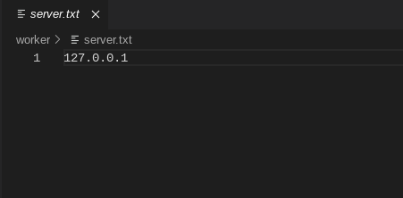

# Installation

Currently the only supported environment is linux, however the entire system could run on windows without too much suffering. This guide covers getting the software up and running, and does not delve into more baremetal implementation like the actual physical system setup, or various strategies for keeping the software running. For that, you should see [Typical Layout](LAYOUT.md).

## Basic Setup

The very first step should be to install system dependencies. Nodejs (only tested on v16) is required, as well as git for cloning the repository. All other dependencies are listed below

| Dependencies                                                           | For             | Why?                                                                                                                                                                                                                                    |
| ---------------------------------------------------------------------- | --------------- | --------------------------------------------------------------------------------------------------------------------------------------------------------------------------------------------------------------------------------------- |
| ffmpeg, zip, tar, imagemagick                                                       | Server & Worker | Both server and client use these commands. FFmpeg is for stitching frames into a video, zip and tar are for packaging blender and animation content.                                                                                    |
| [npm canvas dependencies](https://www.npmjs.com/package/canvas) | Server          | Combining chunks into frames. Imagemagick was considered as it is a default on some systems, however it produced corrupted images when provided blender render portions with transparent areas due to reasons I am not able to explain. |

### Build & Start Server

#### Option 1: Prepackaged release of your architecture

Go to the releases page on the [Github Repo](https://github.com/Arkanic/renderfarm), find the releases page, and download the server THAT MATCHES YOUR ARCHITECTURE. If you can't find one that matches, follow option 2.

Unzip the server file with `unzip <zip file>.zip` and follow the steps as per normal.

#### Option 2: Build manually (all other systems)

`git clone https://github.com/Arkanic/renderfarm && cd renderfarm`

```
cd server
npm i
npm run build
```

if you get some weird node-gyp error, revisit the [canvas npm page](https://www.npmjs.com/package/canvas) and make sure you have installed all of the required dependencies.

#### Starting

Once all of the files have installed run the start command to start the server. The server will run for a couple of seconds, and then exit.

```
npm start
```

The program will exit with the following message:

```
blender.tar.xz not found in /data!!!
download it from blender.org, later versions can be installed from client.
```

You need to go to the [official blender website](https://blender.org) and download the .tar.xz blender download that fits both your system and cpu architecture of your workers. Presuming the workers all are on an x64 system, the package will look something like `blender-3.4.1-linux-x64.tar.xz`. Rename this file to `blender.tar.xz` and put it inside of the `data` folder that has now appeared in the `server` directory. Your file structure should now look something like this:

```
renderfarm
    |
    __ worker
    __ server
        |
        __ data
            |
            __ blender.tar.xz
```

Now when you run `npm start` again the server should start, and stay on. If it does the server is now completely online and running. Take note of your servers' ip address, as the workers will need this to connect.

If you visit `http://<server's local ip address>:8080/` in your browser (e.g. https://192.168.1.123:8080/) you will be able to access the web interface for uploading projects. For more detailed information see [usage.md](./USAGE.md)

### Build & start a single worker

On your worker machine clone the respoitory, the same way as above. If there is a worker release that supports your architecture, use that, and unzip it as displayed in the server section.

Alternatively, to build:

`git clone https://github.com/Arkanic/renderfarm && cd renderfarm`

```
cd worker
npm i
npm run build
```

The installation should not error even if you are missing the zip/tar packages. These tools normally come prepackaged in a generic linux distribution, but make sure these are installed anyway as a sanity check.

In the worker directory (the one you are currently in now, NOT the worker/worker directory, which contains the code) create a file called `server.txt` and place the ip address of your server in it, without any `http://` or port number.



This is all you need to start the server. if you want to start the render server now simply run `npm start`, just like the server. The worker will keep on rendering until it crashes due to no server connection, or it is otherwise terminated.

#### Custom names

When the worker is first run it will create a file called `name.txt`. This is a randomly generated orc name (don't ask why). If you wish you can change this to any name that you would like. Note that only the first line of the file is read.
