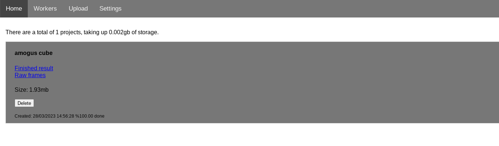

# Usage

## Server

### Server Task

It may be advisable to use something like systemctl to keep the server online constantly in the background, so that if the server shuts down the server will automatically boot again. That being said, the server should be a dedicated machine that IS NOT EXPOSED to the wider internet. Keeping the server online while you are using the server for something else is not advised.

#### Ports

`2254` Is the api endpoint for both the dashboard and the workers. The workers use this to communicate with the server. The dashboard also uses this to get its information.

`8080` Is the statically hosted web interface. The api calls from the interface are made to :2254, whereas :8080 statically hosts all the files.

### Web Interface

The web interface is the interface for uploading blender projects, viewing the server status, and downloading the finished render files. It can be accessed by visiting `http://<the ip of the server>:8080/`.

#### Home Page

The home page will show all projects that are currently rendering in a list, and the storage consumed by it. On each item, rendered or unrendered, there is the option to delete it. Some things are of note here:

- Deleting an unrendered project will delete exactly the same, however all the progress made on the render will be lost.
- Deleting a finished project (once you have downloaded the finished render or zip file) is considered standard practise, as the project would otherwise be filling up storage on the render server.

Once a project has finished rendering, it will appear greyed out. Once the finished project has finished compositing - stitching the finished frames together, two links will appear on the project.

- "Finished Result" contains a direct link to the image file (if it is a single frame being rendered) or an mp4 video (if a video is being rendered)
- "Raw Frames" contains a direct link to a .zip file containing all of the image "chunks" (directly rendered by the workers) that have not been stitched together in any way. The frames follow the format of `<project id>-<frame number>-<row rendered>-<column rendered>.<image format>`. The purpose of this is for people who have very specific image requirements that might get mangled by the compositor stitching the frames together. For normal use you won't need this file.

#### Upload Page

