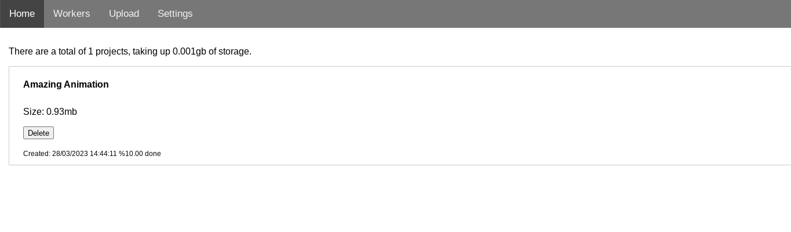
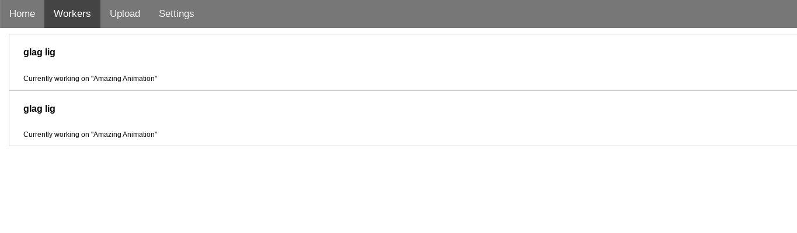
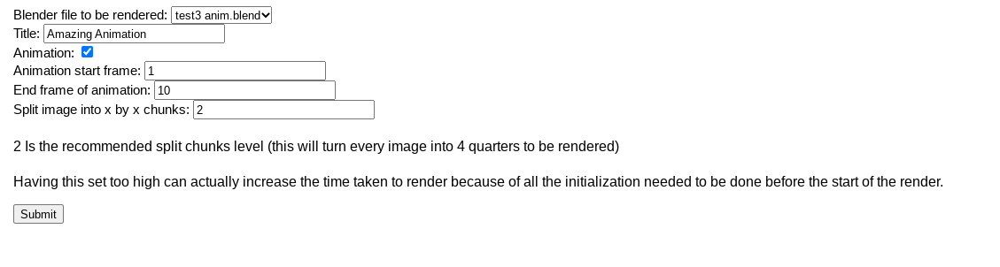
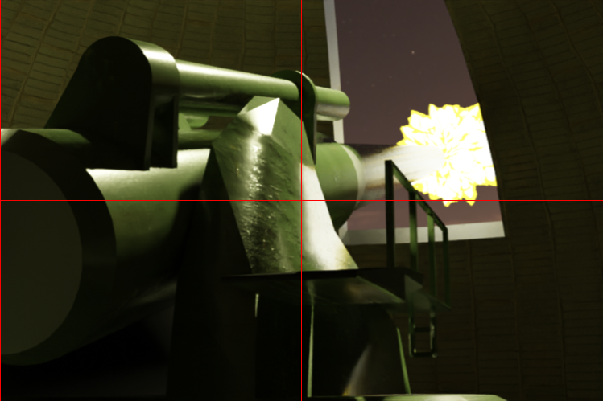
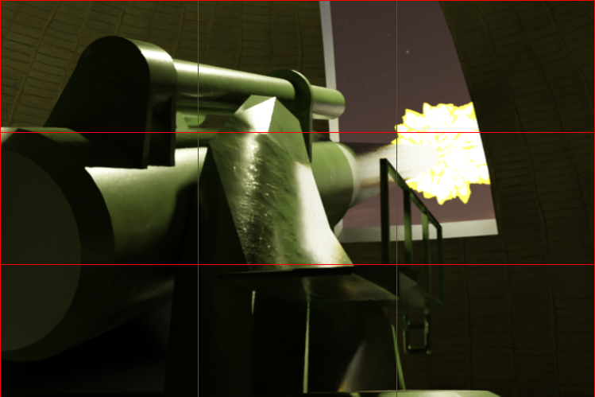
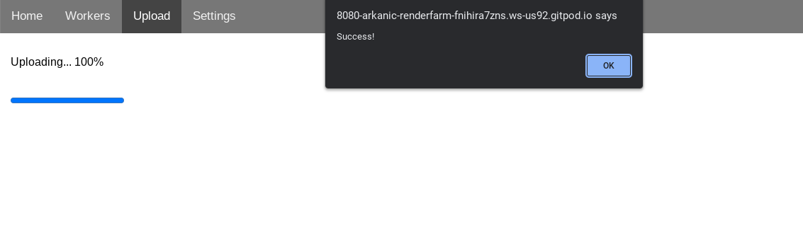
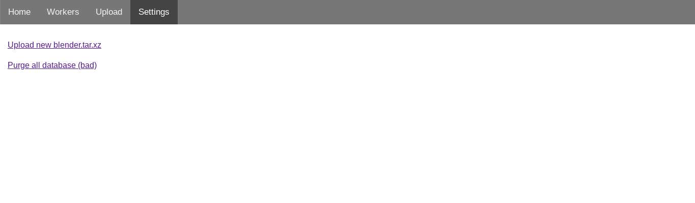

# Usage

## Server

### Server Task

It may be advisable to use something like systemctl to keep the server online constantly in the background, so that if the server shuts down the server will automatically boot again. That being said, the server should be a dedicated machine that IS NOT EXPOSED to the wider internet. Keeping the server online while you are using the server for something else is not advised.

#### Ports

`2254` Is the api endpoint for both the dashboard and the workers. The workers use this to communicate with the server. The dashboard also uses this to get its information.

`8080` Is the statically hosted web interface. The api calls from the interface are made to :2254, whereas :8080 statically hosts all the files.

### Web Interface

The web interface is the interface for uploading blender projects, viewing the server status, and downloading the finished render files. It can be accessed by visiting `http://<the ip of the server>:8080/`.

#### Home Page



NOTE: The home page may look different from what is displayed in this documentation due to UI changes, but all the buttons will retain the same functionality - following through the process will give the same result!

The home page will show all projects that are currently rendering in a list, and the storage consumed by it. On each item, rendered or unrendered, there is the option to delete it. Some things are of note here:

- Deleting an unrendered project will delete exactly the same, however all the progress made on the render will be lost.
- Deleting a finished project (once you have downloaded the finished render or zip file) is considered standard practise, as the project would otherwise be filling up storage on the render server.

Once a project has finished rendering, it will appear greyed out. Once the finished project has finished compositing - stitching the finished frames together, two links will appear on the project.


- "Finished Result" contains a direct link to the image file (if it is a single frame being rendered) or an mp4 video (if a video is being rendered)
- "Raw Frames" contains a direct link to a .zip file containing all of the image "chunks" (directly rendered by the workers) that have not been stitched together in any way. The frames follow the format of `<project id>-<frame number>-<row rendered>-<column rendered>.<image format>`. The purpose of this is for people who have very specific image requirements that might get mangled by the compositor stitching the frames together. For normal use you won't need this file.

#### Workers Page

This page displays all the currently online workers, and what they are currently rendering. The workers are displayed as per their name. To customize the names of the workers, see [install.md](./INSTALL.md).



#### Upload Page

This page lets you upload a project to the renderfarm to be rendered.

##### Creating a zip file for the renderfarm

Projects are uploaded as a .zip file because it is the best way to preserve the assets and file structures of a render. If only .blend files were uploaded, it would be impossible to render the scene if the file used external files like textures and multiple imported blend objects.

###### Building projects for the renderfarm

For all the blend files in your project, open them and go `File > External Data > Make All Paths Relative`. Then save the file. This setting changes how blender stores the pathnames for external assets. For example, a file that is stored in "C:/Users/Bob/Documents/blender/textues/funny.png" will now be stored as "./textures/funny.png". The purpose of this is to make the blender file not relevant to the system it is being rendered on, as the prior path is only valid for the one machine it was created on.

You should make sure your blender project has a folder structure where all the textures are in child folders to the blender file. This means that your folder structure should look something like the following:

```
monkey-project
    |
    __ monkey.blend
    __ assets
        |
        __ fur_16k.hdr
        __ tree.png
        __ background_16k.hdr
    __ files
        |
        __ ape.blend
```

You don't have to order your project exactly like this, but the purpose is to illustrate how you should have all your files in once place so that the parent folder (in this case `monkey-project`) can be zipped neatly without any unrelated files. If you had a project that looked something like the following:

```
blender
    |
    __ textures
        |
        __ texture-for-monkey.png
        __ completely-unrelated-12gb-file.zip
    __ blend
        |
        __ monkey.blend
        __ other-project.blend
```

it cannot be neatly zipped without including other unrelated files which will bloat the zip file.

Zip the folder for upload. On windows this can be achieved by Right Click > Send To > Compressed (Zipped) Folder. Make sure that all the assets needed will be inside the zip file.

Visit the renderfarm dashboard and click "upload". You should see the following screen:


Click on the button to upload your zipped blender file (with all assets), and click next. You will now see this page:


- **Blender file to be rendered**: This is a dropdown menu that shows all of the .blend files in your zip folder. Select the blend file that is your main project.
- **Title**: This is just to be able to clearly tell which project is which on the dashboard
- **Animation**: Tick this checkbox if you want to create an animation. The configuration page will modify itself to look like this:



- **Frame to render** or **Animation start frame** for animations: For pictures this is the frame to render. For animations this is the frame to start rendering at, inclusive of the current number
- **End frame of animation** for animations: The last frame to render, inclusive of the number (ie an animation set to start at 1 and end at 5 will render frames 1, 2, 3, 4, and 5)
- **Split image into x by x chunks**: Cut each frame into this many rows horizontally and vertically. Each "chunk" is rendered individually. This is good for rendering in parallel, but if set too high this can slow the render down due to the amount of initialization required for blender (the more chunks, the more times over it has to do this) If set to 2 this will give you 4 chunks per frame, if set to 3 it will give you 9, etc

*Sample of cutinto 2 (lines added for demonstration):*



This will produce 4 chunks that will be rendered seperately

*Sample of cutinto 3 (lines added for demonstration):*



This will produce 9 chunks that will be rendered seperately

Cutinto is mainly useful for distributing a complex render that is a single frame among computers. There is not much having 20 computers if your render is stuck on one machine. Another use is for out-of-memory errors. By reducing the portion of the image being rendered the ram usage can also be reduced, so if blender is consistenly crashing due to running out of memory you may want to increase the cutinto.

**Once you have chosen your correct options click "Submit" to start uploading the project**



Once the upload has completed you will get a prompt like this. When you click ok the page will reload, and you should see your new project in the list of currently rendering projects.


#### Settings Page



From here you can:

##### Upload a new `blender.tar.xz`

If a new blender version comes out you can use this option to upload a new blender.tar.xz file from blender.org. Make sure the architecture of the download is the same architecture as what the workers use.

##### Purge the database

If thinks get really broken, you can delete the entire database and crash the renderfarm. **NOTE:** this will delete all of the renders, all projects, and all progress on unfinished scenes! use at your own risk!!!

##### Custom password

The dashboard password can be modified by running `server/tools/genpassword.js` to generate a new password hash. Stop the server, replace the hash in `server/data/shadow` with your own, and start the server again. The new password should now be your custom one.